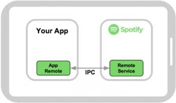
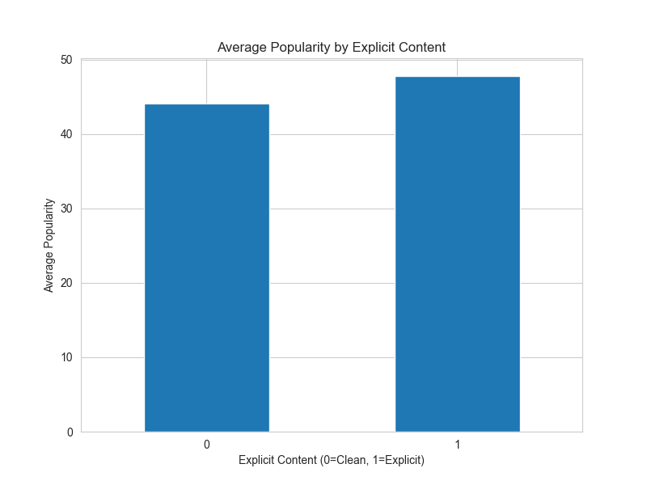
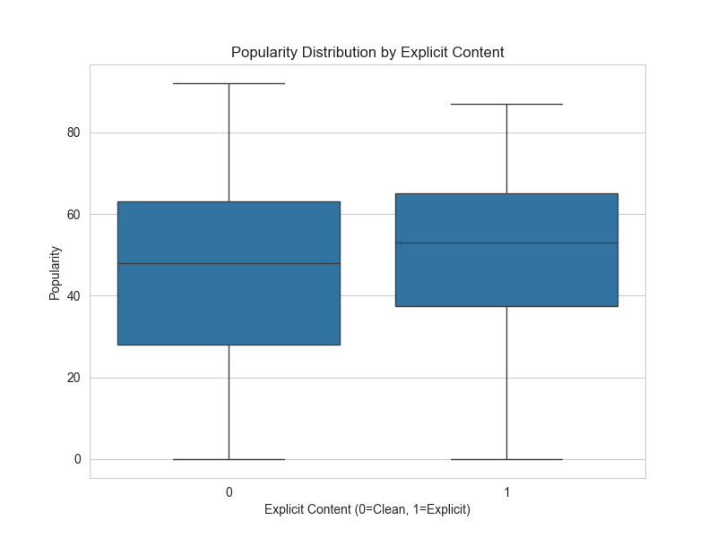

# Motivation and Ethics

If you are like me, you like to listen to music. There are a lot of different ways that you can stream music,
there's Apple Music, Spotify, Youtube Music, etc. Streaming services collect a lot of data, not only on you
put they also have a lot of data connected to each song and album. Spotify releases some of this data at the
beginning of the year to highlight some of your statistics from the previous year, they don't release all the data however.
I was interested in a few of the statitics that they don't really share including the popularity of some of the songs that I listen
to, this is one of the features that you can get and is encoded into the song data that spotify stores. Because this is my own data
I found it ethical to get and share because it was from my own consent. All of the data that I was getting was public information
and is not behind any paywalls.

# How to Access the Data

Spotify makes it fairly simple to access your data as long as you have an account. To access this data, first
you have to got to the [Spotify Developer](https://developer.spotify.com/documentation/web-api)
and follow the instructions there, they are fairly straightforward. After following the instructions there,
we are on to the coding!

# Coding

When accessing your Spotify data, it is important to have good scraping and API request etiquette, most
websites will have a wait-time that they ask you to adhere to so as to not overload their systems or trigger
their security into thinking that they are getting attacked. You can read more about that [here](https://www.datacamp.com/blog/ethical-web-scraping)
Because we are using an API, we don't have to worry about this too much but it is still good practice and depending on
the amount of data that you are requesting, you can still get blocked.

Spotify has written a few packages that we will need to access our data, but they are fairly simple to
implement. If you would like to read their documentations, they can be found below.

- [Spotipy](https://spotipy.readthedocs.io/en/2.25.1/) This is used to access the API
- [SpotifyOAuth](https://spotipy.readthedocs.io/en/2.13.0/?highlight=oauth#authorization-code-flow) This is needed for authentication

When you access the API, you can get a plethora of data, including data on artists, playlists that you have curated,
specific songs and account information. The link above thoroughly explains the possibilites.
You will also need the regular data manipulation and plotting libraries such as [Pandas](https://pandas.pydata.org/docs/), [Matplotlib](https://matplotlib.org/stable/), and [Seaborn](https://seaborn.pydata.org/index.html)

# Own experience

As stated earlier, I was interested in the data that my playlists held. In order to have good eitqutte and not
be blocked by the amount of requests that I was sending, I limited my scope to my 50 most recent playlists.
This included playlists that I made as well as playlists that friends have made that I have added to my library.
I was interested to see how [popular](https://developer.spotify.com/documentation/web-api/reference/get-an-artists-top-tracks#:~:text=of%20the%20track.-,popularity,-integer) the songs were that I listened to.

# Results

After running my scripts I ended up with 2179 songs, after cleaning the data I found that the
average popularity of the music from my 50 most recent playlists was ~44 meaning that they are
not being played very frequently and thus not very popular. The song that had the highest popularity was Iris by the Goo Goo Dolls,
this had a popularity score of 92 meaning that it is a fairly popular song. I was also interested to see if
the popularity of the songs that I listened to were influenced at all by whether or not it was marked as explicit.
The graphs can be seen below.

# Data Overview

Here’s a quick summary of the structure and variables in my dataset after cleaning:

| Variable | Type | Description |
|-----------|------|-------------|
| `track_name` | String | Title of the song |
| `artist_name` | String | Primary artist of the song |
| `album_name` | String | Album title |
| `popularity` | Numeric (0–100) | Spotify’s popularity score for the track |
| `explicit` | Boolean | Whether the song is marked explicit (this is One-Hot encoded) |
| `duration_ms` | Numeric | Length of the track in milliseconds |
| `playlist_name` | String | Name of the playlist the song came from |

In total, my dataset includes **2,179 songs** and **7 features** across my 50 most recent playlists.

# Do it yourself!

If you are interested in performing a similar exploration of your Spotify playlist and song data,
[here](https://github.com/sethfrand/Spotify-data#) is a link to my Github repo that has my full scripts for accessing the data from the Spotify API
and the process of cleaning the data.
