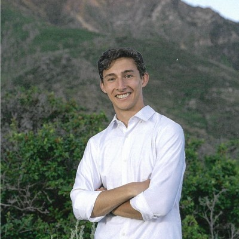

## Background

- Studying Data Science at Brigham Young University, Minoring in Russian
- Interested in National Security, Cybersecurity, and Data Science
- Hope to work for a government agency in the future. 

## Education

- **Computer Science: Data Science** - Brigham Young University, 2027
- **Relevant Coursework**: Statistics, Data Analysis, Programming, Algorithms, Software Engineering, Russian, etc.

## Skills & Interests
- Interested in learning more about data science, analytics, and visualization.
- Love to learn new programming languages and tools.
- Love to learn foreign languages as they open up new opportunities and allow me to connect with more people.

### Technical Skills
- **Programming**: Python, C++, C, Java
- **Data Analysis**: Pandas, NumPy, SQL
- **Visualization**: Matplotlib, Seaborn
- **Machine Learning**: Scikit-learn, TensorFlow (beginner)
- **Data Collection**: Web scraping, APIs
- **Tools**: Jupyter Notebooks, Git/GitHub, VS Code, Quarto, JetBrains, Clion, Arduino IDE, Truenas

### Areas of Interest
- National Security
- Cybersecurity
- Data Science
- Machine Learning
- Foreign Languages (Russian, Polish, Chinese)
- Deep Learning
- Artificial Intelligence
- RAG

## Goals

Describe what you hope to achieve through your data science journey:

- I hope to combine the fields of data science and cybersecurity to help protect national security.
- I want to develop skills that will allow me to analyze large datasets to find patterns and insights

## Interests and Hobbies

I love to learn new things and to push myself to learn. I enjoy spending time outside 
and I love to run. I am currently training for a marathon and would like to 
venture into ultramarathons in the future. When I am not in school or working,
I enjoy spending time with my wife and having adventures with her.

## Contact

- **Email**: Sethp.frandsen@gmail.com
- **GitHub**: [github.com/your-sethfrand](https://github.com/sethfrand)
- **LinkedIn**: [linkedin.com/in/seth-frand-sf](https://www.linkedin.com/in/seth-frandsen-sf)

*This portfolio showcases my learning progress and projects completed during my data science studies.*